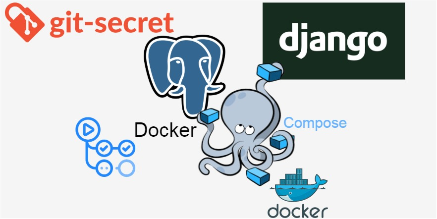
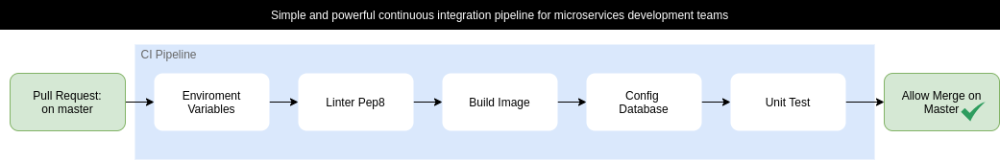
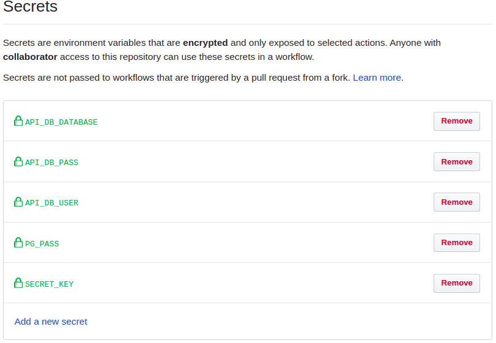

# Simple and powerful continuous integration pipeline for microservices development teams



[Python](https://www.python.org/) - **3.6.0**

[Django](https://www.djangoproject.com/) - **2.2.5**

[PostgreSQL]() - **11**

[Django RestFramework](https://www.django-rest-framework.org/) - 3.9.4

[Docker]() - **18.09.7**

[Docker-Compose]() - **1.24.1** 

# Continues Intregration with git-actions and git-secrets


1 - Create git secrets variables for the sensitive variables. \
   * <b> Settings > Secrets > Add all the secrets. </b> 
   
   
   * Those secrets are <b>encrypted variables</b> used in workflows/main.yml.

2 - This simple pipeline is powerful for microservices development teamns.

3 - First enforce the code style using PEP 8 best practies.

4 - Build images and Run unit tests.    
 
    
# Installations on localhost 
## Create a .env for [Python Decouple](https://pypi.org/project/python-decouple/) sensitive variables:

1 - Create enviroment variables for using in .env

```
$ export API_DB_USER=<Choose you PostgreSQL username>
$ export API_DB_PASS=<Choose you PostgreSQL password>
$ export API_DB_DATABASE=<Choose you PostgreSQL Database>
``` 

2 - Create the .env in manage.py's directory
```
.env 
SECRET_KEY=<$DJANGO_SECRET_KEY>
DATABASE_URL= postgres://<$API_DB_USER>:<$API_DB_PASS>@db_postgres:5432/<$API_DB_DATABASE>
PG_PASS=<$PG_ADMIN_ROOT_PASS>
``` 

3 - Building all images for later be using for containers:
```
$ make build
```

4 - Execute this command to create PostgreSQL database name as db_postgres: 
```
make up-postgresql
```

5 - Wait 10s and then execute those commands to set username and password credentials for database:
```
Create role with enviroment variables
$ make create-role
```
```
Alter role to be active 
$ make alter-role
```

```
Alter role to give permission to create database 
$ make permission-role
```
```
Create Database for django 
$ make create-db
```
6 - If you wanna up all contaieners:
 
```
make up
```

7 - Create API container in development mode with deamons:
 
```
make run

```   
    
## API Simple structure as a CRUD 
### produto:
  * Urls: 
        * api/produto/ \
            * / \
            * /create \
            * /detail-update/{id} \
            * /delete/{id}
### predido:
  
  * Urls: 
        * api/produto/ \
            * / \
            * /create \
            * /detail-update/{id} \
            * /delete/{id}


      
